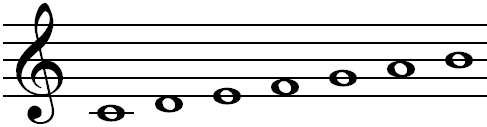

# 輸入格式說明

將旋律以文字形式輸入，並輸入歌詞，即可自動產生簡譜。
旋律以及歌詞分開說明。

## 基本格式

### 旋律
#### 調號 ```<key>```
* 直接輸入什麼調
    - ```<key> C``` 表示C大調。
    - ```<key> #F``` 表示升F大調。
    - 如果是小調，請輸入關係大調。
* 輸入五線譜每行開頭有幾個升降記號
    - ```<key> 0#``` 或 ```<key> 0$``` 表示沒有升降記號，即C調。
    - ```<key> 2#``` 表示兩個升記號，即D調。
    - ```<key> 5$``` 表示兩個降記號，即降D調。
* ```<key> XX``` 請獨立一行。

#### 拍號 ```<time>```
* ```<time> 4/4``` 表示4/4拍。
* ```<time> 6/8``` 表示6/8拍。
* 目前可接受的有 ```2/4```、```3/4```、```4/4```、```6/8```、```9/8```、```12/8```。
* ```<time> X/X``` 請獨立一行。

#### 音符
每個音符由 __音高__ 與 __長度__ 組成。
音符的部分換行不影響結果，空白也不影響，可依需求增加。
* 音高
    - 輸入音名 ```cdefgab``` 或是 ```1234567``` 代表不同的音。另外，```0``` 為休止符。
      
    - 從中央 C 往上至 B (見上圖，共7個音，包含升降) 視為基本音域。
      往下一個八度，在音名後加上 ```,``` ；往上一個八度，加上 ```'``` 。
      例如： ```d``` 或 ```2``` 為中央 D，```d'``` 或 ```2'``` 則為高音 D。
    - 臨時升降記號加在音名前面， ```#``` 為升記號， ```$``` 為降記號， ```%``` 為還原記號。
      例如： ```$a``` 為降 A。
* 長度
    - ```c``` 為 1 拍。
    - ```c - -``` 為 3 拍，以此類推 (每個 ```-``` 多加一拍)。
    - ```c_``` 為半拍 (記號與五線譜類似)， ```c__``` (雙底線) 為 1/4 拍。
    - ```c.``` 為一拍半 (記號與五線譜類似)，```c_.``` 為 3/4 拍。
    - 三連音： ```c_/3``` 為 1/3 拍，因此 ```c_/3 d_/3 e_/3``` 總共一拍。
    - 連結線： ```c ~ c``` 相當於 ```c -```，但是單一音符不能跨小節，建議依照五線譜。
* 小節線
    - 第一個小節線必須輸入，如 ```5, | 1 - 3_1_ 3 - ``` (奇異恩典)。
    - 若非後起拍 (亦即歌曲從第一拍開始)，可省略小節線。

### 歌詞
* ```<tag> 主歌```： ```<主歌>``` 會出現在接下來第一張投影片的左上角，以此類推。
* __每行歌詞__ 最終會成為 __投影片的一行__，因此若太多字時最後的結果會很擠或重疊在一起。
* 若有一個歌詞對應兩個音符以上 (以連結線連結至前一音符的不算)，應在歌詞後加上 ```~```。
* 程式會自動過濾常見的標點符號如 ```，``` 與 ```。``` 等等，但還是建議自行刪除以免被當成歌詞。


## 進階功能

### 改變拍號
* 一首歌可有多種不同的 ```<time>```，此時變換拍號之前必須為完整一小節的結束。
* 例如，以下範例不合格，因為第一行定義一小節有四拍，可是第三行換拍號前總共只有三拍。
  
  ```
  <time> 4/4
  1 2 3
  <time> 3/4
  1 2 3 | 4 5 6
  ```

### 輸入首調
* 對於會自行把五線譜轉換成簡譜者，若將調號輸入為 ```<key> solfa```，可直接輸入首調唱名 ```0``` 至 ```7``` ( ```0``` 為休止符)。
* 不允許輸入原先 ```cdefgab``` 之名稱，但對於基本音域附近的音，可以使用額外的英文字母如下 (按照鍵盤順序)。
  - 下方一個八度：
    - ```z``` : ```1,```
    - ```x``` : ```2,```
    - ```c``` : ```3,```
    - ```v``` : ```4,```
    - ```b``` : ```5,```
    - ```n``` : ```6,```
    - ```m``` : ```7,```
  - 上方一個八度：
    - ```q``` : ```1'```
    - ```w``` : ```2'```
    - ```e``` : ```3'```
    - ```r``` : ```4'```
    - ```t``` : ```5'```
    - ```y``` : ```6'```
    - ```u``` : ```7'```

### 綜合拍號
* 歌曲若是常常變換拍號，以致 ```<time> X/X``` 需要輸入多次，可由　```<time> ?/4``` 或 ```<time> ?/8```  代替。
* 若是要用此方式，必須輸入所有小節線，不可省略。
* 例如：```1 2 3 | 1 2 | 3 4 5 | 3 4```。

### 等時輸入法
* 由於決某些歌曲有許多 __連結線__，造成輸入較為複雜，為了解決此問題，等時輸入法提供了不需輸入連結線的方式。
  此輸入法在有許多切分音之歌曲尤其好用。
* 要使用此輸入法，在拍號後面加上 ```hyphen=X```，其中 X 可為數字 4、8、16、32，代表幾分音符為一基本單位。
  - 例如：```<time> 4/4 hyphen=8``` 代表 8 分音符為基本單位。
  - 此時，若輸入 ```1--23---```，原本每一拍的長度變為一基本單位 (半拍)，因此等同於標準輸入法的 ```1. 2_ 3 -```。
* 使用此輸入法時，不允許輸入 __附點__ 或 __底線__，所以所有音符的長度都為基本單位的倍數。
  因此，基本單位最好選擇為此歌曲最短的音符長度。
* 若是臨時要改為正常的輸入法，可以使用 ```[]``` (見下方之 __小技巧__)。
* 由於每個音符的長度有可能跨小節，此時程式會自動把音符分為更短的多個音符，並加上連結線，但連結線還是可以手動輸入。
* 注意：綜合拍號如 ```<time> ?/4``` 不能搭配等時輸入法。
* 如同標準輸入法，只有第一個小節線需要輸入。

### 小技巧
* 連續多個同樣長度的音符，可以 ```[``` 與 ```]``` 包住 __音高__ 之後再輸入長度。
  例如：```1_ 2_ $3_ 4_``` 可以寫成 ```[12$34]_```。
* 十六分音符(雙底線)如 ```c__``` 可以 ```c=``` 取代。


